# SRE Intro
## Useful Links:
- Global Infrastructure: https://aws.amazon.com/about-aws/global-infrastructure/
- Chmod Calculator: https://chmod-calculator.com/ 
- Amazon VPC Concepts: https://docs.aws.amazon.com/vpc/latest/userguide/what-is-amazon-vpc.html
- DevOps Article: https://medium.com/@ahshahkhan/devops-culture-and-cicd-3761cfc62450 
- Microsoft Definition of Architectures: https://docs.microsoft.com/en-us/azure/architecture/guide/architecture-styles/ 
- AWS WAF (Web Application Firewall): https://aws.amazon.com/waf/ 
- AWS S3 Documentation: https://docs.aws.amazon.com/cli/latest/reference/s3/ 
- Docker Cheatsheet: https://dockerlabs.collabnix.com/docker/cheatsheet/
## User Journey
## User Experience
### Cloud Computing with AWS

## SRE Role:
- Making sure the user journey is satisfactory (without any errors)

## Benefits of Cloud Computing:
### Ease of use
- Users are able to quickly and securely host their applications
- You can use AWS Management Console or APIs to access AWS's application hosting platform
### Flexibility
- Able to select any of the different services you require
- Receive a virtual environment used to load the software and services for your application
- Easy to migrate 
### Robustness
- If one region goes down the Auto Scaler can redirect to another Availability Zone (AZ)
- Can scale up and down on demand
### Cost effective
- You only pay resources you use (Compute power, storage)
- No long term contracts or up-front commitments

## AWS Services:
- Amazon Web Services (AWS) - A cloud services provider with the largest market share
- Region represents a separate geographical area (Ireland, London)
- Availability Zones (AZ) are the actual data centres within each region, there must be at least two AZ in each region
- Not all services are available at each AZ

## AWS Global Infrastructure:
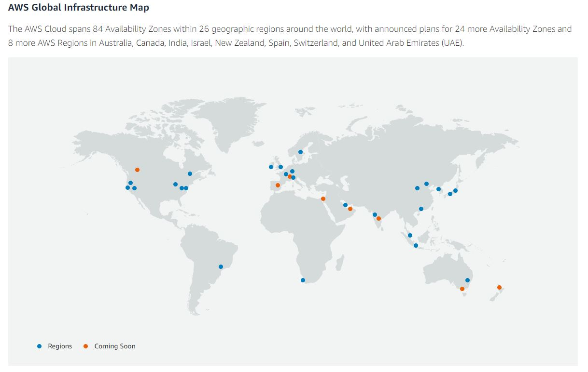

## Content Delivery Network (CDN):
- Servers that are geographically closer to the user and stores your application
- Goal is to provide high availability and performance

## Solutions:
### On-premise
- User owns all the servers and stores them locally
- More secure but puts the costs on the user for maintenance and security
### Public cloud
- User rents all the server usage from a provider 
- Provider handles maintenance/security, user only pays for what they use
### Hybrid
- User keeps some data local (on-prem) and other data in the cloud (Government, Banks)
- Allows for better security where needed and lower cost where it isn't needed

## AWS Diagram:
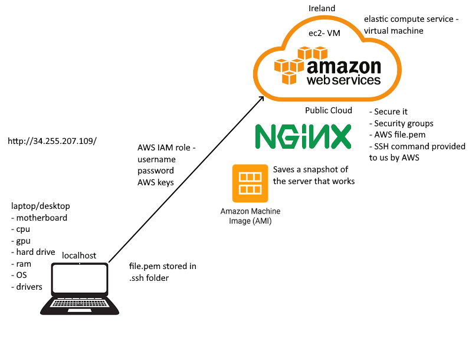
- First you need an IAM (Identity and Access Management) role that provides you with permissions
- ec2 (elastic compute service) - Virtual Machine (VM)
- Secure it with Security groups and create a file.pem
- Store the file.pem in the .ssh folder
- VM: Computer file that behaves like an actual computer. AWS needs to know the specs for the VM similar to the specs of a laptop/desktop

## Launch an Instance:
- Select your Region (Ireland - eu-west-1)
- Select EC2 then Launch Instance
- Select OS (Ubuntu Server 18.04)
- Choose an instance  that decides CPU, RAM, Network Performance (t2.micro)
- Configure instance details (enter Subnet and enable Public IP)
- Add storage (default)
- Add tags (Name - 105_sre_shakilur_nginx)
- Configure security groups (SSH rules to your IP, HTTP rule for global access)
- SSH uses port 22, HTTP uses port 80
- Launch instance

## SSH into an Instance:
- Locate your private key (105.pem)
- Change permissions of file to readonly `chmod 400 105.pem`
- Connect to instance from git bash `ssh -i "105.pem" ubuntu@ec2-34-255-207-109.eu-west-1.compute.amazonaws.com`
- Now you are inside the VM run the following commands:
    - `sudo apt-get update -y`
    - `sudo apt-get upgrade -y`
    - `sudo apt-get install nginx -y`
- Go to the public IP address to check the instance is running

## Linux Commands:
- How to become a super user (USE CAREFULLY): `sudo su` then `exit` to return
- How to check the status of a service: `systemctl status name_service`
- How to start a service: `sudo systemctl start name_service`
- How to stop a service: `sudo systemctl stop name_service`
- How to enable a service (start on startup): `sudo systemctl enable service_name` 
- How to install a package: `sudo apt-get install package_name -y`
- How to remove a package: `sudo apt remove package_name -y`
- How to check all processes: `top`
- Who am I: `uname` or `uname -a`
- Where am I: `pwd`
- How to create a directory: `mkdir dir_name`
- How to change directory: `cd dir_name` or `cd ..`
- How to check files: `ls` or `ls -a`
- How to create a file: `touch file_name` or `nano file_name`
- How to read contents of a file without entering the file: `cat file_name`
- How to copy a file: `cp file_name destination_name`
- How to move a file (also used to rename file): `mv file_name destination_name`
- How to delete a directory (remove forcefully): `sudo rm -rf dir_name`
- How to delete a file: `rm file_name`

## File Permissions:
- How to check a file permissions: `ll`
- How to change a files permission: `chmod required_permission file_name`
- How to create an exe file: `touch file_name.sh`
- Examples: `400` - readonly, `+x` - executable
- write `w`, read `r`, executable `x`

## Bash Scripting - Automate Process with a Script:
```sh
#!/bin/bash
# it must start with #!/bin/bash

# run updates
sudo apt-get update -y

# run upgrades
sudo apt-get upgrade -y

# install nginx
sudo apt-get install nginx -y

# ensure it is running - start nginx
sudo systemctl start nginx

# enable nginx
sudo systemctl enable nginx
```
- Change file to exe file: `chmod +x provision.sh`
- How to run an exe file: `./provision.sh`

## Automate Tomcat with a Script:
```sh
#!/bin/bash
# it must start with #!/bin/bash

# run updates
sudo apt-get update -y

# run upgrades
sudo apt-get upgrade -y

# install tomcat
sudo apt-get install tomcat9 -y

# ensure it is running - start tomcat
sudo systemctl start tomcat9

# enable tomcat
sudo systemctl enable tomcat9
```
- Check the status of tomcat: `systemctl status tomcat9`
- Change file to exe file: `chmod +x createTomcat.sh`
- How to run an exe file: `./createTomcat.sh`
- Tomcat server runs on port: `8080`, Add it to the security group on AWS
- Tomcat server lets developers implement an array of Java applications
- Tomcat is also used to deploy web applications (like a web server)

## Technical Questions:
### What is a VPC?
- VPC stands for Virtual Private Cloud
- It is a secure and isolated private cloud that is hosted within a public cloud
- Private clouds are cloud computing environments dedicated to a single customer 
### What is an internet gateway?
- A horizontally scaled (highly available) VPC component that allows communications between your VPC and the internet
- Node that connects two networks with different transmission protocols together
- It is where data stops before entering the server
### What are route tables?
- A database that keeps track of paths, and uses that information to forward traffic
- Contain a set of rules, called routes, that determines where traffic from subnet/gateway is directed
### What is a subnet?
- A range of IP addresses in your VPC
- They divide the network into more networks
### What are NACLs?
- NACL stands for Network Access Control List
- Controls traffic to/from a subnet based on a set of inbound/outbound rules
- They can be seen as a firewall for the subnet
### What are security groups?
- Acts as a virtual firewall for an EC2 instance
- Once attached to an EC2 instance it controls inbound/outbound traffic for the instance
### How did you secure your app on the public cloud?
- We created security groups that controlled the inbound/outbound traffic
- We stored a key locally that allowed us to ssh into our instances
### What are the outbound rules for security groups by default? and why?
- The default is to allow all outbound traffic to leave 
- Server doesn't limit who is requesting the resource and what port they are on
- Outbound is readonly so there are no security issues
### What is the command to kill a process in linux?
- Using Process Name: `killall proccess`
- Using Process ID: `kill processID`
- Unresponsive Process: `kill -9 processID`

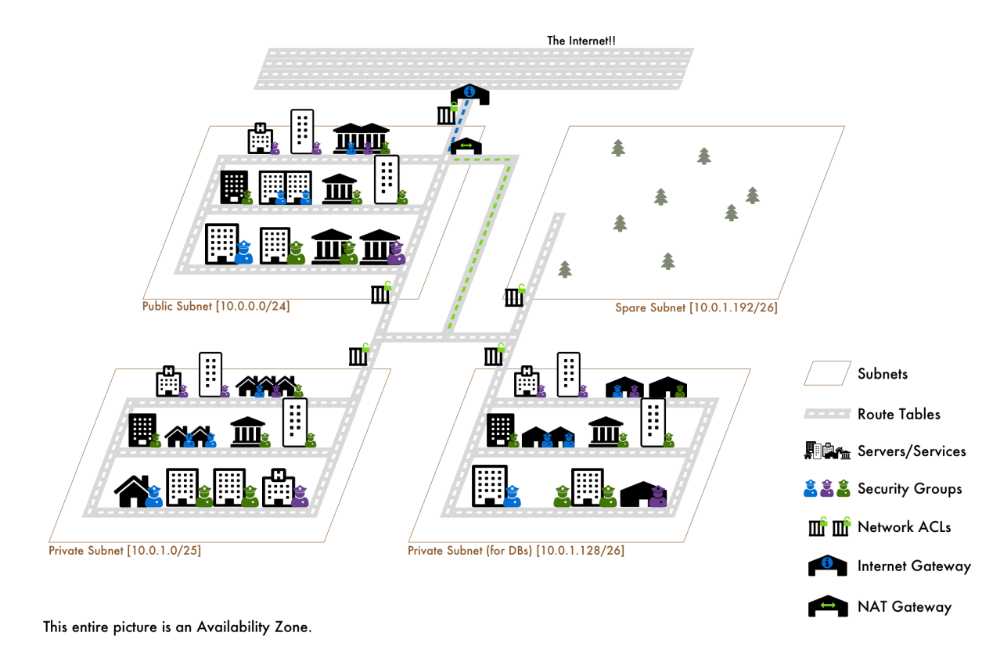

## Monolith and Microservices Architecture:

### Monolith:
- Fruitful for simple and lightweight apps
- Set expectations easy to manage, portable, lightweight
- Not for scalable businesses 
### Microservices:
- Everything is a service - good for scalability
- New features can be added while the working code still exists
- Each service can be tested individually
- Scale up: when size increases (micro -> medium)
- Scale out: create more instances when there are more users

## 2-tier and N-tier Architecture:
### 2-tier:
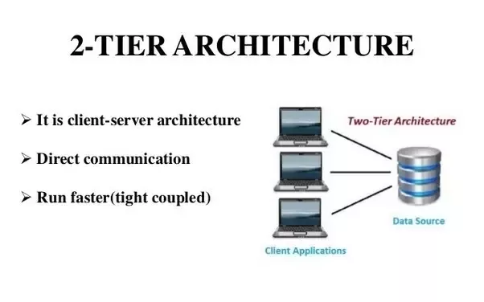
- Presentation layer or interface that runs on the client
- Data layer or data structure that gets stored on a server
### N-tier:
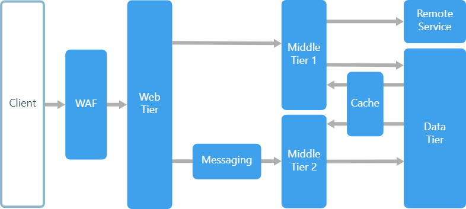
- An N-tier architecture divides an application into logical layers and physical tiers (N number of tiers)
- A tier is a layer of the application that crosses a process or server boundary
- Layers are a way to separate responsibilities and manage dependencies with each layer having a specific responsibility.
- Higher layers can use services in lower layers, but not the other way round

## Notes from Article:
- DevOps: Software development methodology that combines development and IT operations through the entire SDLC
- Docker: Virtualization platform to containerise you app (Paypal, Spotify)
- Separates non-dependent steps and runs them in parallel
- Containers allow developers to package up an application with all its parts (libraries, dependencies), and ship it all as one
- CICD (Continuous Integration Continuous Delivery and Deployment): backbone of DevOps practices and automation (Facebook, Netflix)
- Benefits are: Faster software builds, customer satisfaction by deploying the app in time
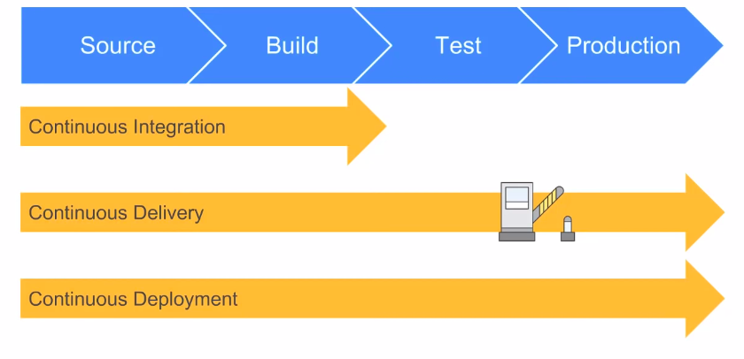
- Continuous Integration: Developers merge/commit code to main branch, fully automated build and test process which gives feedback within minutes.
- Continuous Delivery: An extension of CI to make sure that you can release new changes to your customer in a sustainable way. On top of automating your testing, you also automate your release process and can deploy at any point with a single click (manually).
- Continuous Deployment: Automates the deployment part on top of doing the delivery part

## SDLC: End-to-End product development
- Planning: Have an idea of the product and planning how to create it
- Designing: Create designs for the product
- Development: Writing the code/Creating the product
- Testing: Must pass tests before moving forward to production
- Staging: Holding area before sending out to production (git add .). Allows you to make last minute fixes
- Production: It's live - in the users hands

## Github Best Practices:
- One person reviewing the code is required
- Branches should be created for individual tasks, then deleted once merged
- Someone who is more knowledgeable should merge the branches
- When a branch is merged everyone working on it must `git pull`
- `git` will thell you all the commands for git
- If you delete the .git file you need to `git init` again, then push to github

## Secure a Web App on AWS:
- Using AWS WAF (Web Application Firewall): helps to protect your web application from common web exploits
- Allows you to create security rules that controls bot traffic and blocks common attack patterns (SQL injection, Cross-site scripting)
- Use Security Groups to control the inbound/outbound traffic

## S3 - Simple Storage Service:
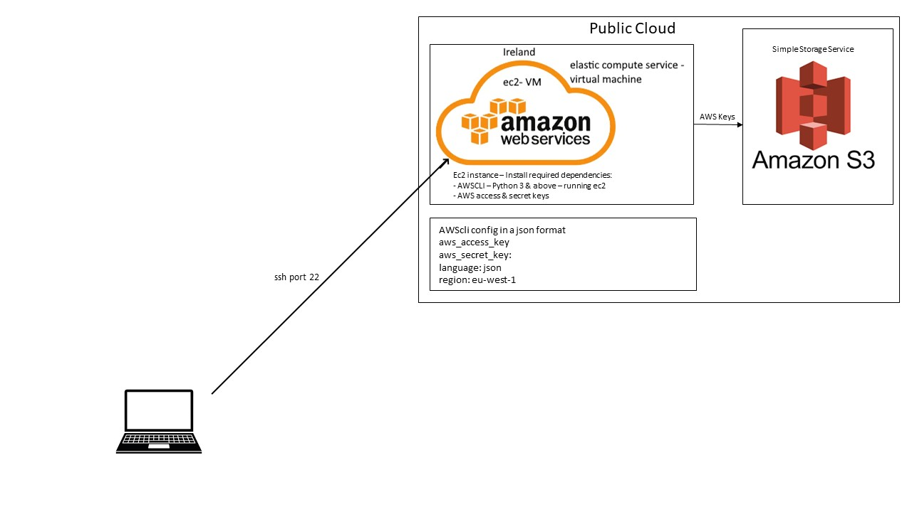
- Storage on the Cloud and is globally available (highly available: stored on multiple regions)
- Storage classes - how quickly, frequently you want to access data
- How quickly you get charged as well
- S3 Glacier: not available on demand - cheaper (storing ex-employee data)
- Used for: Data backup - Disaster recovery plan (DR)

## S3 Codealong:
```sh
# install python 3.7
sudo apt-get install python
sudo apt-get install python3-pip

# let system know we are using python 3.7
alias python=python3

# check python --version
python --version

# run update and upgrade
sudo apt update -y
sudo apt upgrade -y

# install pip3
python3 -m pip install awscli

# install awscli
sudo apt install awscli

# setup aws config file to store aws keys to access s3 from our ec2
aws configure

# list dir in s3
aws s3 ls

# CRUD: 
# make a bucket (folder) 
aws s3 mb s3://105-sre-shakilur

# upload data from ec2 to s3 
touch test.txt
aws s3 cp test.txt s3://105-sre-shakilur

# download data from s3 (READ)
rm test.txt
aws s3 cp s3://105-sre-shakilur/test.txt /home/ubuntu

# delete data on s3 from ec2 using awscli
aws s3 rm s3://105-sre-shakilur/test.txt
aws s3 rb s3://105-sre-shakilur
```
## Deploying an API:

### Pre-requisites:
- Have an ec2 instance running `Ubuntu Server 18.04`
- Have Nginx installed on that your ec2 instance
- Refactor your code so the connection string has localhost
```sh
sudo apt update -y
sudo apt upgrade -y
sudo reboot
```

### Microsoft SQL Server
- Install MSSQL onto your ec2 instance: https://docs.microsoft.com/en-us/sql/linux/quickstart-install-connect-ubuntu?view=sql-server-ver15 
- Install Microsoft SQL Server Management Studio (SSMS): https://docs.microsoft.com/en-us/sql/linux/sql-server-linux-manage-ssms?view=sql-server-ver15
- Use SSMS to install the Northwind database: https://github.com/Microsoft/sql-server-samples/tree/master/samples/databases/northwind-pubs

### Release the API
- Open project in Visual Studio
- Go to: View -> Terminal
- Paste the following command: `dotnet publish -c release -r ubuntu.18.04-x64`
- Go to: Projects folder -> bin -> Release -> net6.0
- You should have a `ubuntu.18.04-x64` folder which needs to be compressed (.zip)

### Deploy the API
- Rename the .zip file to API.zip and move it into the .ssh/ folder
- Open a terminal (Git Bash): `scp -i 105.pem API.zip ubuntu@ec2-xx-xxx-xxx-xx.compute-1.amazonaws.com:`
- SSH into your ec2 instance
```sh
# Install unzip
sudo apt install unzip

# Unzip the API.zip
sudo unzip API.zip

# Move into the new directory
cd ubuntu.18.04-x64/

# Change permissions of the API to be executable
sudo chmod 777 ProductsApiApp

# Run the API
sudo ./ProductsApiApp
``` 

### Test API Locally
- SSH into your ec2 instance (on another terminal)
- Run the API: `curl localhost:5000/api/products/1` 
- Should return a JSON string back

### Reverse Proxy
- Start Nginx and Enable it on startup
```sh
sudo systemctl start nginx
sudo systemctl enable nginx
``` 
- Configure Nginx
```sh
sudo nano /etc/nginx/sites-available/default

# Delete all text and replace it with:
server {
    listen        80;
    server_name   example.com *.example.com;
    location / {
        proxy_pass         http://127.0.0.1:5000;
        proxy_http_version 1.1;
        proxy_set_header   Upgrade $http_upgrade;
        proxy_set_header   Connection keep-alive;
        proxy_set_header   Host $host;
        proxy_cache_bypass $http_upgrade;
        proxy_set_header   X-Forwarded-For $proxy_add_x_forwarded_for;
        proxy_set_header   X-Forwarded-Proto $scheme;
    }
}
```
- From this tutorial: https://docs.microsoft.com/en-us/aspnet/core/host-and-deploy/linux-nginx?view=aspnetcore-6.0 

### Create a Bash Script
- https://www.youtube.com/watch?v=-aKb-k8B8xo
- Begin by being inside of the ubuntu.18.04-x64 directory: `cd ~/ubuntu.18.04-x64`
```sh
# Create my-startup.sh
touch my-startup.sh

# Make my-startup.sh executable
sudo chmod +x my-startup.sh

# Write the script that runs the API
#!/bin/bash
cd /home/ubuntu/ubuntu.18.04-x64
sudo ./ProductsApiApp
```

### Create a Service
- Move to correct directory: `cd /etc/systemd/system`
```sh
# Create my-startup.service
sudo nano my-startup.service

# Paste the following to run your bash script
[Unit]
Description=My Startup

[Service]
ExecStart=/home/ubuntu/ubuntu.18.04-x64/my-startup.sh

[Install]
WantedBy=multi-user.target

# Start your new service
sudo systemctl start my-startup.service

# Enable your new service
sudo systemctl enable my-startup.service
```
- Now you API application should run on startup

### Diagram of the API Project:


## Docker & Containers:
### Diagram of Docker (REST API):
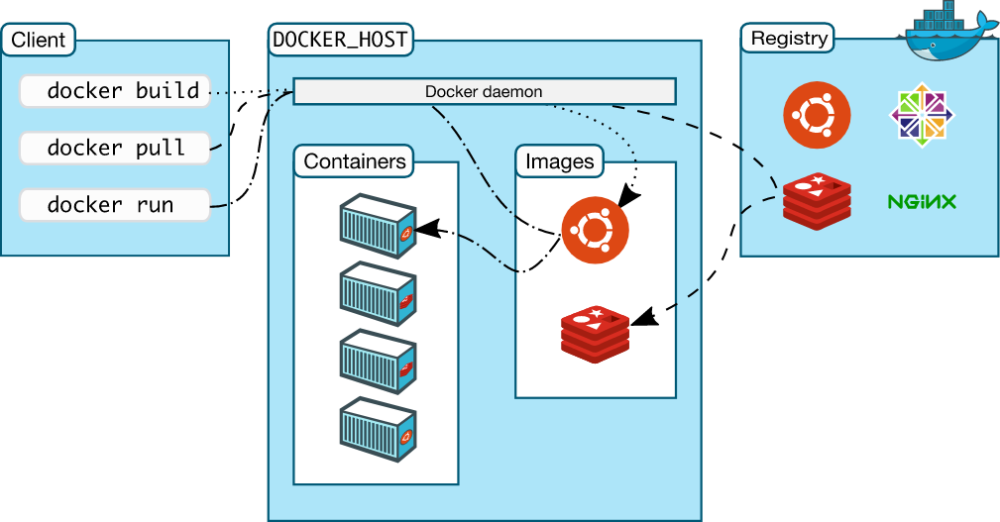
### Docker
- Containerisation platform: runs applications in isolated containers
- Docker Hub: like github for pushing images
- Uses microservice architecture to deploy applications
- Benefits of Docker:
    - Speed: It is lightweight and runs quickly
    - Fault Isolation: Each container is isolated so a fault in one container will not affect another
- Virtualisation: takes the resources for itself (reserves the resources)
- VM requires the hypervisor (translator) to communicate with the host OS
- Docker communicates natively with the system kernel
- Docker shares the resources (only uses them when needed)

- Images are immutable (can't be changed)
- Containers can be edited (kinda like instances of an image)
### VM vs Docker:
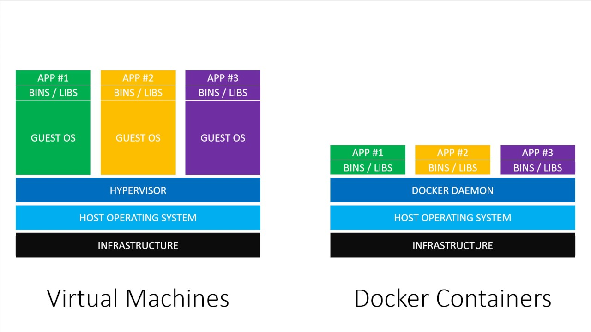

## Install Docker
### Install Docker from Website
- Link: https://docs.docker.com/desktop/windows/install/
- Troubleshoot: https://docs.docker.com/desktop/windows/troubleshoot/#virtualization
### Enable Virtualisation in BIOS (MSI)
- Boot into BIOS [Del]
- Select "Overclocking"
- Go to "OC Explore Mode" and turn that to "Expert"
- Scroll to "CPU Features"
- Select "SVM Mode" and "Enable"
- Save and Exit (F10)

### Install WSL update
- Step 4: https://docs.microsoft.com/en-us/windows/wsl/install-manual#step-4---download-the-linux-kernel-update-package 

## Docker Commands:
```sh
# See images you have installed
docker images

# delete docker image
docker image rm imageID

# docker pull downloads the image
docker pull name

# downloads and runs containers
docker run

# see containers that are running
docker ps

# see containers that are exited  (not running)
docker ps -a

# delete a running container (force)
docker rm containerID -f 

# run nginx (detached) (port)
docker run -d -p 80:80 nginx 

# stop container
docker stop containerID

# start container
docker start containerID

# interact with container using shell
alias docker="winpty docker"
docker exec -it containerID sh

# check logs of container
docker logs containerID

# download docker docs on localhost
docker run -d -p 4000:4000 docs/docker.github.io 
```

## Docker Shell Commands:
```sh
# find the html
cd /usr/share/nginx/html

# view the index.html
cat index.html

# update and install nano
apt update -y
apt install nano -y

# edit the html

# how to leave a container
exit
```
## Docker Copy Files:
```bash
# copy file from localhost to docker container (open bash in file location)
docker cp index.html containerID:/usr/share/nginx/html
```
## Create Docker Image and Push
```bash
# create an image from a container (saved locally)
docker commit containerID username/repo_name

# push the image to dockerhub (globally available)
docker push username/repo_name:latest

# pull the image from dockerhub and run it
docker run -d -p 80:80 shakilrahman/105_sre
```
## Volumes

- Volume makes data persistent
- Can be different sizes
- Can be shared by localhost and container/shared between containers
- Sync your localhost to your container

## Docker File for Automation of Building Customised Images (Building a Microservice):
- Automate Image Building of our Custom Nginx Image
- Create a `Dockerfile` in the same location as our index.html
- Decide which base image to use for your image (Nginx)
```Dockerfile
# Select base image 
FROM nginx

# Label it - add optional details
LABEL MAINTAINER=SHAKIL

# Copy the data from localhost to container (index.html -> /usr/share/nginx/html/)
COPY index.html /usr/share/nginx/html

# Expose the required port (Port 80 for Nginx)
EXPOSE 80

# Launch the app 
# CMD will run the command, in this case to launch the image when we create a container
CMD ["nginx", "-g", "daemon off;"]
```
- Test the Image Locally to Ensure it Works
- If it runs then you can push it to Dockerhub
- Other Containerisation Platforms:
    - Crio - Rocket - Docker

## Docker API
Tutorial: https://www.youtube.com/watch?v=f0lMGPB10bM&ab_channel=LesJackson 
- Publish the API into a Folder
- Create a `Dockerfile` in the base folder
```Dockerfile
# select base image
FROM mcr.microsoft.com/dotnet/aspnet:6.0

# label it
LABEL MAINTAINER=SHAKIL

# copy the published app
COPY bin/Release/net6.0/publish/ App/
WORKDIR /App

# expose port 80
EXPOSE 80

# run dotnet command on the .dll file
ENTRYPOINT ["dotnet", "ProductsApiApp.dll"]
```
- Open Git Bash inside the ProductsApiApp folder
```bash
# build the image with the Dockerfile
docker build -t shakilrahman/105_sre_api .

# push the image to Dockerhub
docker push shakilrahman/105_sre_api

# run the image in a container (listens on port 80)
docker run -d -p 50:80 shakilrahman/105_sre_api
```

## Microsoft SQL Server with Northwind:
- Create docker container with MSSQL 
```bash
docker run -e "ACCEPT_EULA=Y" -e "SA_PASSWORD=yourStrong(!)Password" -p 1433:1433 -d mcr.microsoft.com/mssql/server:2019-CU15-ubuntu-20.04
```
- Open `Microsoft SQL Server Management Studio`
- Connect using SQL Server Authentication
    - Server Name: localhost, 1433
    - Login: sa
    - Password: strongPassw0rd
- Create `New Query` and Install Northwind database
- Create an image of your MSSQL Server with Northwind
```bash
docker commit containerID shakilrahman/mssql-northwind
```

## Docker Compose (YAML)
```yml
version: '3'
services:
  db:
    image: shakilrahman/mssql-northwind
    environment:
      ACCEPT_EULA: "Y"
      SA_PASSWORD: "Shakil22!"
      MSSQL_PID: Express
    ports:
      - "1433:1433"
  products-api:
    build: .
    ports:
      - "80:80"
    depends_on:
      - db
```
- Before running this make sure Port 80 and Port 1433 are open
- Refactor the code to so connection string contains `server = db, 1433` (matches the name in docker-compose.yaml)
- Creates the MSSQL database with Northwind using `shakilrahman/mssql-northwind`
- Creates the API using the `Dockerfile` 
- Run: `docker-compose up`
- Two Containers should be created and the API should run on Port 80 (localhost)
- Tutorial: https://www.youtube.com/watch?v=4V7CwC_4oss

## Kubernetes:
- Also known as K8
- Developed and run by Google for over 15 years
- Now owned by the Linux foundation and is open-source
- Used to Orchestrate the containers and Organise how they connect
- Advantages:
  - Self Healing: When a pod crashes another is spun up automatically
  - Load Balancing: When a pod crashes the load balancer redirects the traffic to another pod 
  - Auto Scaling: Allows you to create more pods when required
  - Automated rollouts and rollback: When an image is not working it can rollback to a working version
- Each pod (smallest item in K8) has its own IP address
- If a pod crashes then the controller-manager will delete the pod and then creates a replica
- Load balancer will redirect the traffic to another pod (Scheduler)

### Kubernetes Architecture:

### Kubernetes Deployment:
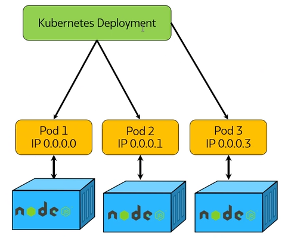
### Best Practice
- Start with a small team, test, learn and move on
- Use Docker to contrainerise your apps for fast and constant delivery
- Orchestration with K8 to make your life easier

## Kubernetes Commands:
```bash
# list all commands
kubectl

# get the kubernetes services 
kubectl get service
kubectl get svc

# get service created by cluster
kubectl get svc nginx_svc 
kubectl get deploy nginx_deploy

# list all the pods (running and not running)
kubectl get pods

# get more information on the pods
# describe can be used for other svc and more
kubectl describe pod pod_name
kubectl describe pod podID

# name of deployement, pod, replica set
kubectl get service_name
```
## Kubernetes Cheatsheet (`kubectl`):
### Basic Commands (Beginner):
```bash
  create        Create a resource from a file or from stdin
  expose        Take a replication controller, service, deployment or pod and expose it as a new Kubernetes service
  run           Run a particular image on the cluster
  set           Set specific features on objects
```
### Basic Commands (Intermediate):
```bash
  explain       Get documentation for a resource
  get           Display one or many resources
  edit          Edit a resource on the server
  delete        Delete resources by file names, stdin, resources and names, or by resources and label selector
```
### Deploy Commands:
```bash
  rollout       Manage the rollout of a resource
  scale         Set a new size for a deployment, replica set, or replication controller
  autoscale     Auto-scale a deployment, replica set, stateful set, or replication controller
```
### Cluster Management Commands:
```bash
  certificate   Modify certificate resources.
  cluster-info  Display cluster information
  top           Display resource (CPU/memory) usage
  cordon        Mark node as unschedulable
  uncordon      Mark node as schedulable
  drain         Drain node in preparation for maintenance
  taint         Update the taints on one or more nodes
```
### Troubleshooting and Debugging Commands:
```bash
  describe      Show details of a specific resource or group of resources
  logs          Print the logs for a container in a pod
  attach        Attach to a running container
  exec          Execute a command in a container
  port-forward  Forward one or more local ports to a pod
  proxy         Run a proxy to the Kubernetes API server
  cp            Copy files and directories to and from containers
  auth          Inspect authorization
  debug         Create debugging sessions for troubleshooting workloads and nodes
```
### Advanced Commands:
```bash
  diff          Diff the live version against a would-be applied version
  apply         Apply a configuration to a resource by file name or stdin
  patch         Update fields of a resource
  replace       Replace a resource by file name or stdin
  wait          Experimental: Wait for a specific condition on one or many resources
  kustomize     Build a kustomization target from a directory or URL.
```
### Settings Commands:
```bash
  label         Update the labels on a resource
  annotate      Update the annotations on a resource
  completion    Output shell completion code for the specified shell (bash or zsh)
```
### Other Commands:
```bash
  api-resources Print the supported API resources on the server
  api-versions  Print the supported API versions on the server, in the form of "group/version"
  config        Modify kubeconfig files
  plugin        Provides utilities for interacting with plugins
  version       Print the client and server version information
```
## YAML (Yet Another Markup Language):
### What is YAML?
- Yet Another Markup Language
- YAML Ain't Markup Language
### How to create a yml file
- Name file: `filename.yml` or `filename.yaml`
### How to declare it as a YAML file
- Use: `---` (at the top of the new file)
### What are the use case?
- Can be utilised by: K8, Docker-compose, Ansible, Cloud-formation
- To codify anything and everything in order to automate processes 
### YAML file
- Create a file for `nginx_deploy.yml`
- Create a file for `nginx_svc.yml`
- YML is case sensitive, Indentation is important
### YAML Deployment:
- Create a deployment for nginx with 3 pods/containers
```yml
apiVersion: apps/v1 # which api to use for deployment
kind: Deployment # what kind of service/object you are creating

# what would you like to call it
metadata:
  name: nginx-deployment # naming the deployment

# specification
spec:
  selector:
    matchLabels:
      app: nginx # look for this label to match with K8 service
  # Lets create a replica set with 3 instances/pods
  replicas: 3

  # template to use its label for K8 service to launch in the browser
  template:
    metadata:
      labels:
        app: nginx # This label connects to the service or any other K8 component

    # Define the container specs
    spec:
      containers:
      - name: nginx
        image: shakilrahman/105_sre_nginx:latest
        ports:
        - containerPort: 80
```
- To run the deploy: `kubectl create -f nginx_deployment.yml`
- To get the deploy: `kubectl get deploy nginx-deployment`
- To see the pods: `kubectl get pods`
- Get more information on the deploy: `kubectl describe deploy` 
- Get more information on pods: `kubectl describe podName`
- To delete the deployment: `kubectl delete deploy nginx-deployment`
- To edit a deployment: `kubectl edit deploy nginx-deployment`
- To get all running objects: `kubctl get all`
### YAML Service:
- Create a service: cluster-ip (local), NodePort (global), LoadBalancer (global)
```yml
---
apiVersion: v1
kind: Service

metadata:
  name: nginx-svc
  namespace: default

# Specification to include ports Selector to connect to deployment
spec:
  ports:
  - nodePort: 30442 # range 30000 - 32768
    port: 80 # port to use on localhost
    protocol: TCP
    targetPort: 80 # target our app uses 

# Define the selector and label to connect to nginx deployment
  selector:
    app: nginx # this label connects this service to deployement

  # Creating LoadBalancer type of deployement
  type: LoadBalancer
```
- To run the service: `kubectl create -f nginx_svc.yml` It should now run in `localhost`
- To delete a pod: `kubectl delete pod podID` automatically creates a new pod to replace it
- Get more information on the service: `kubectl describe svc` 
- To delete the service: `kubectl delete svc nginx-deployment`

## Deploying API Microservice in K8 Cluster
### Create API Deployment `api_deployment.yml`:
```yml
apiVersion: apps/v1 # which api to use for deployment
kind: Deployment # what kind of service/object you are creating

# what would you like to call it?
metadata:
  name: api-deployment # naming the deployment

# specification
spec:
  selector:
    matchLabels:
      app: api # look for this label to match with K8 service
  # Lets create a replica set with 3 instances/pods
  replicas: 3

  # template to use its label for K8 service to launch in the browser
  template:
    metadata:
      labels:
        app: api # This label connects to the service or any other K8 component

    # Define the container specs
    spec:
      containers:
      - name: api
        image: shakilrahman/105_sre_api:latest
        ports:
        - containerPort: 80
```
### Create API Service `api_svc.yml`:
```yml
---
apiVersion: v1
kind: Service

metadata:
  name: api-svc
  namespace: default

# Specification to include ports Selector to connect to deployment
spec:
  ports:
  - nodePort: 30443 # range 30000 - 32768
    port: 80 # port to use on localhost
    protocol: TCP
    targetPort: 80 # target our app uses 

# Define the selector and label to connect to nginx deployment
  selector:
    app: api # this label connects this service to deployement

  # Creating LoadBalancer type of deployement
  type: LoadBalancer
```
### API Cluster Diagram:
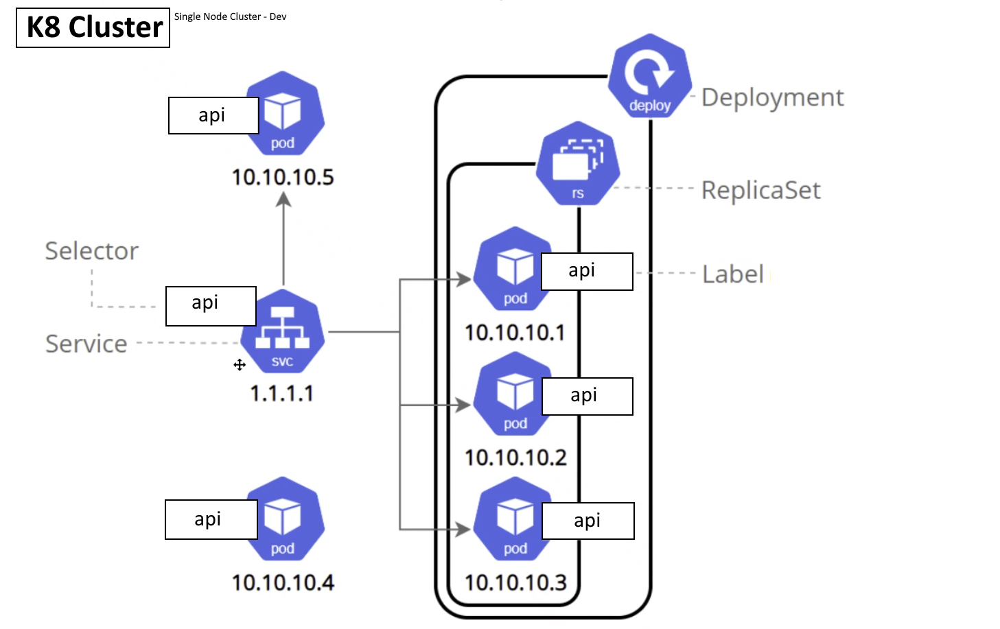