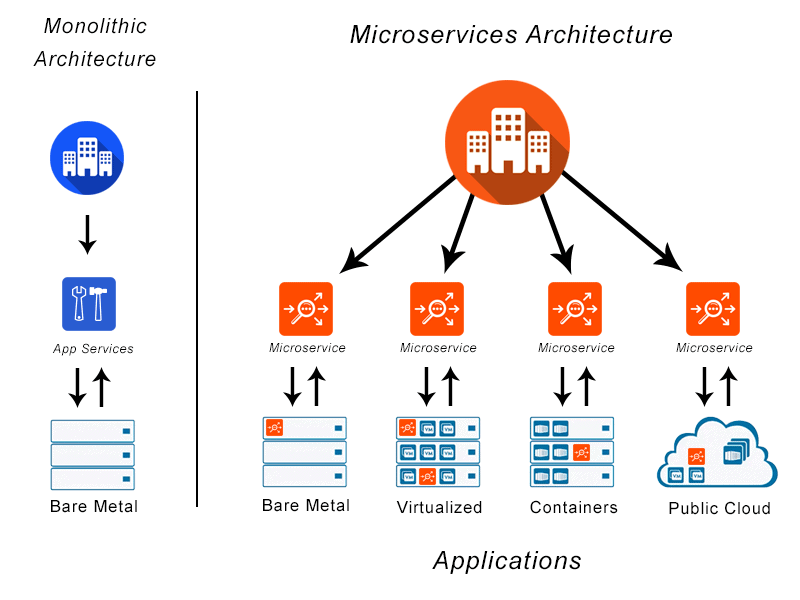

# SRE Intro
## Useful Links:
- Global Infrastructure: https://aws.amazon.com/about-aws/global-infrastructure/
- Chmod Calculator: https://chmod-calculator.com/ 
- Amazon VPC Concepts: https://docs.aws.amazon.com/vpc/latest/userguide/what-is-amazon-vpc.html
- DevOps Article: https://medium.com/@ahshahkhan/devops-culture-and-cicd-3761cfc62450 
- Microsoft Definition of Architectures: https://docs.microsoft.com/en-us/azure/architecture/guide/architecture-styles/ 
- AWS WAF (Web Application Firewall): https://aws.amazon.com/waf/ 
- AWS S3 Documentation: https://docs.aws.amazon.com/cli/latest/reference/s3/ 
## User Journey
## User Experience
### Cloud Computing with AWS

## SRE Role:
- Making sure the user journey is satisfactory (without any errors)

## Benefits of Cloud Computing:
### Ease of use
- Users are able to quickly and securely host their applications
- You can use AWS Management Console or APIs to access AWS's application hosting platform
### Flexibility
- Able to select any of the different services you require
- Receive a virtual environment used to load the software and services for your application
- Easy to migrate 
### Robustness
- If one region goes down the Auto Scaler can redirect to another Availability Zone (AZ)
- Can scale up and down on demand
### Cost effective
- You only pay resources you use (Compute power, storage)
- No long term contracts or up-front commitments

## AWS Services:
- Amazon Web Services (AWS) - A cloud services provider with the largest market share
- Region represents a separate geographical area (Ireland, London)
- Availability Zones (AZ) are the actual data centres within each region, there must be at least two AZ in each region
- Not all services are available at each AZ

## AWS Global Infrastructure:


## Content Delivery Network (CDN):
- Servers that are geographically closer to the user and stores your application
- Goal is to provide high availability and performance

## Solutions:
### On-premise
- User owns all the servers and stores them locally
- More secure but puts the costs on the user for maintenance and security
### Public cloud
- User rents all the server usage from a provider 
- Provider handles maintenance/security, user only pays for what they use
### Hybrid
- User keeps some data local (on-prem) and other data in the cloud (Government, Banks)
- Allows for better security where needed and lower cost where it isn't needed

## AWS Diagram:

- First you need an IAM (Identity and Access Management) role that provides you with permissions
- ec2 (elastic compute service) - Virtual Machine (VM)
- Secure it with Security groups and create a file.pem
- Store the file.pem in the .ssh folder
- VM: Computer file that behaves like an actual computer. AWS needs to know the specs for the VM similar to the specs of a laptop/desktop

## Launch an Instance:
- Select your Region (Ireland - eu-west-1)
- Select EC2 then Launch Instance
- Select OS (Ubuntu Server 18.04)
- Choose an instance  that decides CPU, RAM, Network Performance (t2.micro)
- Configure instance details (enter Subnet and enable Public IP)
- Add storage (default)
- Add tags (Name - 105_sre_shakilur_nginx)
- Configure security groups (SSH rules to your IP, HTTP rule for global access)
- SSH uses port 22, HTTP uses port 80
- Launch instance

## SSH into an Instance:
- Locate your private key (105.pem)
- Change permissions of file to readonly `chmod 400 105.pem`
- Connect to instance from git bash `ssh -i "105.pem" ubuntu@ec2-34-255-207-109.eu-west-1.compute.amazonaws.com`
- Now you are inside the VM run the following commands:
    - `sudo apt-get update -y`
    - `sudo apt-get upgrade -y`
    - `sudo apt-get install nginx -y`
- Go to the public IP address to check the instance is running

## Linux Commands:
- How to become a super user (USE CAREFULLY): `sudo su` then `exit` to return
- How to check the status of a service: `systemctl status name_service`
- How to start a service: `sudo systemctl start name_service`
- How to stop a service: `sudo systemctl stop name_service`
- How to enable a service (start on startup): `sudo systemctl enable service_name` 
- How to install a package: `sudo apt-get install package_name -y`
- How to remove a package: `sudo apt remove package_name -y`
- How to check all processes: `top`
- Who am I: `uname` or `uname -a`
- Where am I: `pwd`
- How to create a directory: `mkdir dir_name`
- How to change directory: `cd dir_name` or `cd ..`
- How to check files: `ls` or `ls -a`
- How to create a file: `touch file_name` or `nano file_name`
- How to read contents of a file without entering the file: `cat file_name`
- How to copy a file: `cp file_name destination_name`
- How to move a file (also used to rename file): `mv file_name destination_name`
- How to delete a directory (remove forcefully): `sudo rm -rf dir_name`
- How to delete a file: `rm file_name`

## File Permissions:
- How to check a file permissions: `ll`
- How to change a files permission: `chmod required_permission file_name`
- How to create an exe file: `touch file_name.sh`
- Examples: `400` - readonly, `+x` - executable
- write `w`, read `r`, executable `x`

## Bash Scripting - Automate Process with a Script:
```
#!/bin/bash
# it must start with #!/bin/bash

# run updates
sudo apt-get update -y

# run upgrades
sudo apt-get upgrade -y

# install nginx
sudo apt-get install nginx -y

# ensure it is running - start nginx
sudo systemctl start nginx

# enable nginx
sudo systemctl enable nginx
```
- Change file to exe file: `chmod +x provision.sh`
- How to run an exe file: `./provision.sh`

## Automate Tomcat with a Script:
```
#!/bin/bash
# it must start with #!/bin/bash

# run updates
sudo apt-get update -y

# run upgrades
sudo apt-get upgrade -y

# install tomcat
sudo apt-get install tomcat9 -y

# ensure it is running - start tomcat
sudo systemctl start tomcat9

# enable tomcat
sudo systemctl enable tomcat9
```
- Check the status of tomcat: `systemctl status tomcat9`
- Change file to exe file: `chmod +x createTomcat.sh`
- How to run an exe file: `./createTomcat.sh`
- Tomcat server runs on port: `8080`, Add it to the security group on AWS
- Tomcat server lets developers implement an array of Java applications
- Tomcat is also used to deploy web applications (like a web server)

## Technical Questions:
### What is a VPC?
- VPC stands for Virtual Private Cloud
- It is a secure and isolated private cloud that is hosted within a public cloud
- Private clouds are cloud computing environments dedicated to a single customer 
### What is an internet gateway?
- A horizontally scaled (highly available) VPC component that allows communications between your VPC and the internet
- Node that connects two networks with different transmission protocols together
- It is where data stops before entering the server
### What are route tables?
- A database that keeps track of paths, and uses that information to forward traffic
- Contain a set of rules, called routes, that determines where traffic from subnet/gateway is directed
### What is a subnet?
- A range of IP addresses in your VPC
- They divide the network into more networks
### What are NACLs?
- NACL stands for Network Access Control List
- Controls traffic to/from a subnet based on a set of inbound/outbound rules
- They can be seen as a firewall for the subnet
### What are security groups?
- Acts as a virtual firewall for an EC2 instance
- Once attached to an EC2 instance it controls inbound/outbound traffic for the instance
### How did you secure your app on the public cloud?
- We created security groups that controlled the inbound/outbound traffic
- We stored a key locally that allowed us to ssh into our instances
### What are the outbound rules for security groups by default? and why?
- The default is to allow all outbound traffic to leave 
- Server doesn't limit who is requesting the resource and what port they are on
- Outbound is readonly so there are no security issues
### What is the command to kill a process in linux?
- Using Process Name: `killall proccess`
- Using Process ID: `kill processID`
- Unresponsive Process: `kill -9 processID`


## Monolith and Microservices Architecture:

### Monolith:
- Fruitful for simple and lightweight apps
- Set expectations easy to manage, portable, lightweight
- Not for scalable businesses 
### Microservices:
- Everything is a service - good for scalability
- New features can be added while the working code still exists
- Each service can be tested individually
- Scale up: when size increases (micro -> medium)
- Scale out: create more instances when there are more users

## 2-tier and N-tier Architecture:
### 2-tier:

- Presentation layer or interface that runs on the client
- Data layer or data structure that gets stored on a server
### N-tier:

- An N-tier architecture divides an application into logical layers and physical tiers (N number of tiers)
- A tier is a layer of the application that crosses a process or server boundary
- Layers are a way to separate responsibilities and manage dependencies with each layer having a specific responsibility.
- Higher layers can use services in lower layers, but not the other way round

## Notes from Article:
- DevOps: Software development methodology that combines development and IT operations through the entire SDLC
- Docker: Virtualization platform to containerise you app (Paypal, Spotify)
- Separates non-dependent steps and runs them in parallel
- Containers allow developers to package up an application with all its parts (libraries, dependencies), and ship it all as one
- CICD (Continuous Integration Continuous Delivery and Deployment): backbone of DevOps practices and automation (Facebook, Netflix)
- Benefits are: Faster software builds, customer satisfaction by deploying the app in time

- Continuous Integration: Developers merge/commit code to main branch, fully automated build and test process which gives feedback within minutes.
- Continuous Delivery: An extension of CI to make sure that you can release new changes to your customer in a sustainable way. On top of automating your testing, you also automate your release process and can deploy at any point with a single click (manually).
- Continuous Deployment: Automates the deployment part on top of doing the delivery part

## SDLC: End-to-End product development
- Planning: Have an idea of the product and planning how to create it
- Designing: Create designs for the product
- Development: Writing the code/Creating the product
- Testing: Must pass tests before moving forward to production
- Staging: Holding area before sending out to production (git add .). Allows you to make last minute fixes
- Production: It's live - in the users hands

## Github Best Practices:
- One person reviewing the code is required
- Branches should be created for individual tasks, then deleted once merged
- Someone who is more knowledgeable should merge the branches
- When a branch is merged everyone working on it must `git pull`
- `git` will thell you all the commands for git
- If you delete the .git file you need to `git init` again, then push to github

## Secure a Web App on AWS:
- Using AWS WAF (Web Application Firewall): helps to protect your web application from common web exploits
- Allows you to create security rules that controls bot traffic and blocks common attack patterns (SQL injection, Cross-site scripting)
- Use Security Groups to control the inbound/outbound traffic

## S3 - Simple Storage Service:

- Storage on the Cloud and is globally available (highly available: stored on multiple regions)
- Storage classes - how quickly, frequently you want to access data
- How quickly you get charged as well
- S3 Glacier: not available on demand - cheaper (storing ex-employee data)
- Used for: Data backup - Disaster recovery plan (DR)

## S3 Codealong:
```
# install python 3.7
sudo apt-get install python
sudo apt-get install python3-pip

# let system know we are using python 3.7
alias python=python3

# check python --version
python --version

# run update and upgrade
sudo apt update -y
sudo apt upgrade -y

# install pip3
python3 -m pip install awscli

# install awscli
sudo apt install awscli

# setup aws config file to store aws keys to access s3 from our ec2
aws configure

# list dir in s3
aws s3 ls

# CRUD: 
# make a bucket (folder) 
aws s3 mb s3://105-sre-shakilur

# upload data from ec2 to s3 
touch test.txt
aws s3 cp test.txt s3://105-sre-shakilur

# download data from s3 (READ)
rm test.txt
aws s3 cp s3://105-sre-shakilur/test.txt /home/ubuntu

# delete data on s3 from ec2 using awscli
aws s3 rm s3://105-sre-shakilur/test.txt
aws s3 rb s3://105-sre-shakilur
```
## AWS Task:
```
$scp -i ~/Desktop/amazon.pem ~/Desktop/MS115.fa  ubuntu@ec2-54-166-128-20.compute-1.amazonaws.com:~/data/
```